## Laboratory #4 – REST API Blueprints - Juan Esteban Rodríguez
# ECI – Software Architecture


---

## Technologies
- Java 21
- Maven 3.9+
- Spring Boot 3.3+
- PostgreSQL
- Docker
- OpenAPI / Swagger


## Project Execution
```bash
mvn clean install
mvn spring-boot:run
```

---
## Swagger Documentation

Open in navigator:  
- Swagger UI: [http://localhost:8082/swagger-ui.html](http://localhost:8080/swagger-ui.html)  
- OpenAPI JSON: [http://localhost:8082/v3/api-docs](http://localhost:8080/v3/api-docs)  

---

## Scaffolding

```
src/main/java/edu/eci/arsw/blueprints
  ├── model/         # Entities: Blueprint, Point
  ├── persistence/   # Interfaces + repositories (InMemory, Postgres)
  ├── services/      # Business logic
  ├── filters/       # Filters (Identity, Redundancy, Undersampling)
  ├── controllers/   # REST Controllers (BlueprintsAPIController)
  └── config/        # Configuration (Swagger/OpenAPI, etc.)
```

---

## API Base URL

```
/api/v1/blueprints
```

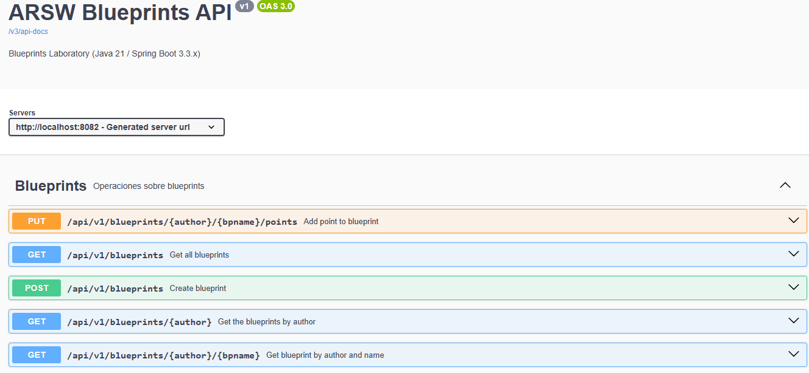

## HTTP Status Code 

| Operation | Status Code    |
|-----------|----------------|
| Successful query | 200 OK         |
| Resource creation | 201 Created    |
| Resource update | 202 Accepted   |
| Invalid request | 400 Bad Request |
| Resource not found | 404 Not Found  |

## Available Endpoints

### Get all blueprints

```http
GET /api/v1/blueprints
```
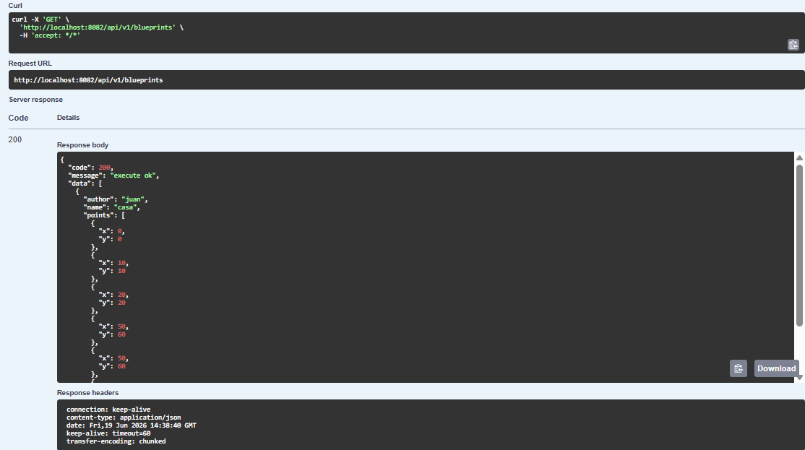

### Get blueprints by author

```http
GET /api/v1/blueprints/{author}
```
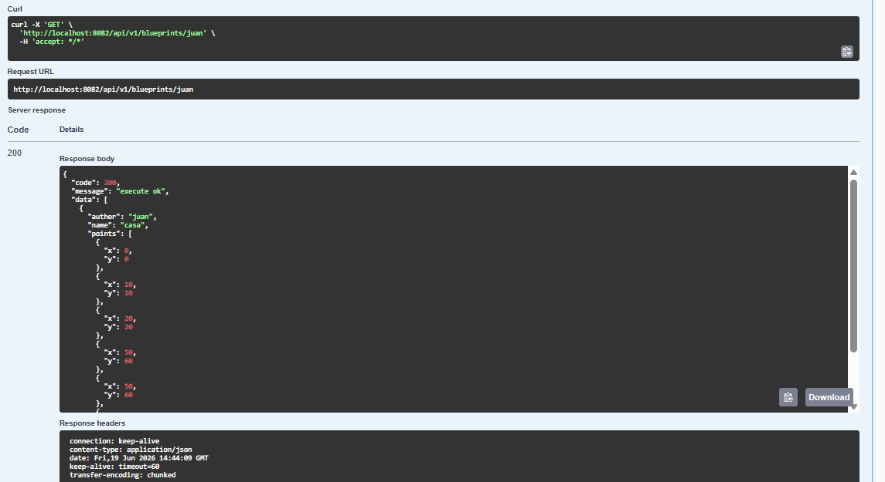

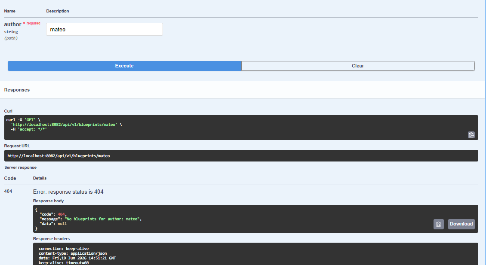

### Get a blueprint by author and name

```http
GET /api/v1/blueprints/{author}/{bpname}
```


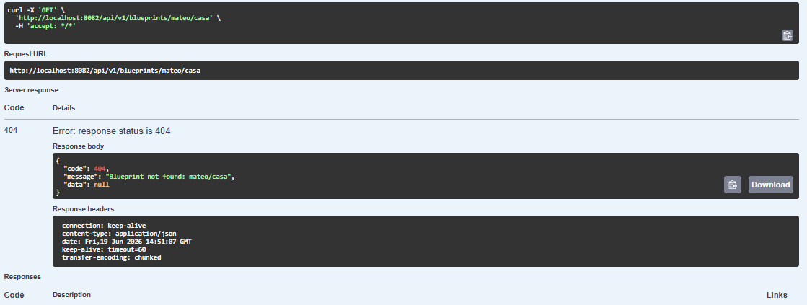


### Create a blueprint

```http
POST /api/v1/blueprints
```
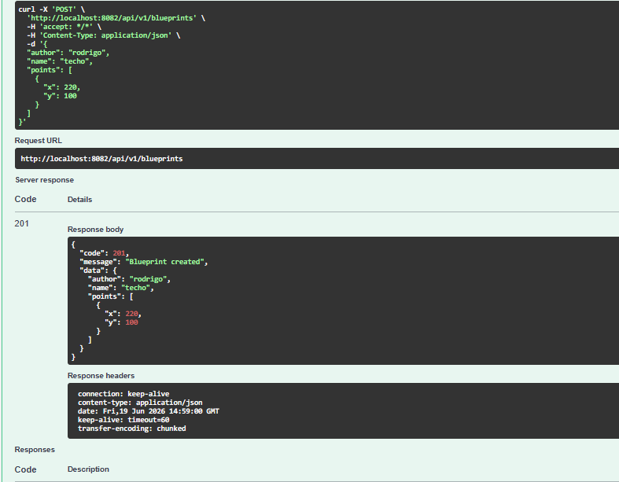

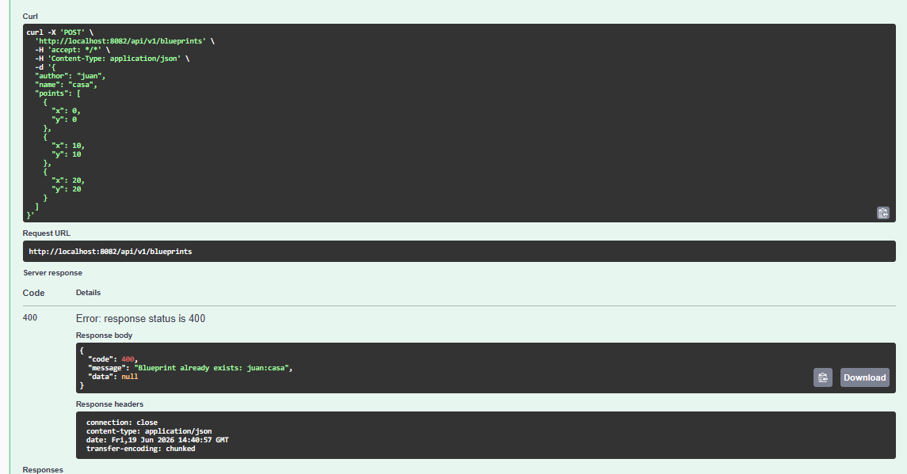

### Add a point to an existing blueprint

```http
PUT /api/v1/blueprints/{author}/{bpname}/points
```
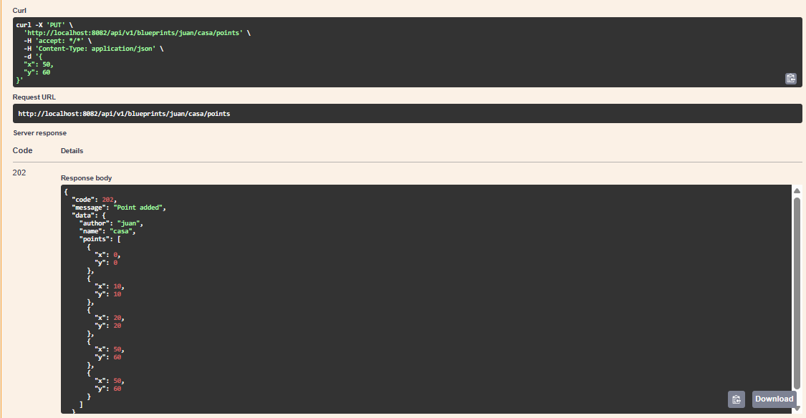

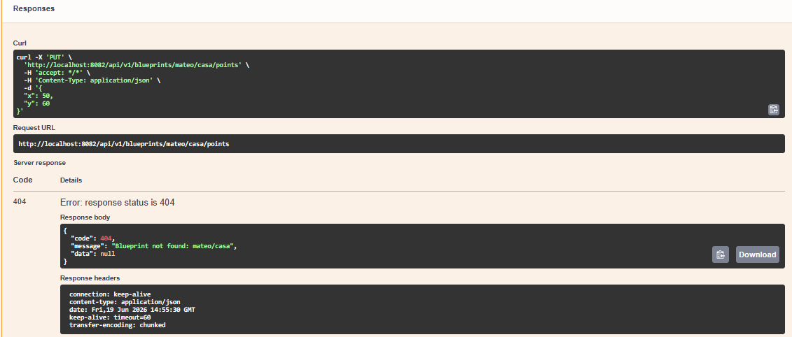

---

## PostgreSQL Configuration

The application uses PostgreSQL running inside Docker.

### Start the database

```bash
docker compose up -d
```

### Database configuration

Located in application.properties in resources

### Database Verification

Connect to PostgreSQL:

```bash
docker exec -it blueprints-db psql -U postgres -d blueprints
```

List tables:

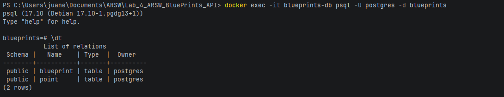

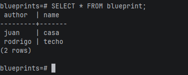

---

## Spring Profiles

The application supports different profiles:

- `postgres`: PostgreSQL persistence.
- `memory`: In-memory persistence.
- `redundancy`: Removes consecutive duplicate points.
- `undersampling`: Keeps one out of every two points.

Example:

```properties
spring.profiles.active=postgres,redundancy
```

## Good Practices Applied

- Layered architecture (Controller, Service, Persistence, Model).
- Dependency Injection using Spring.
- Persistence abstraction through interfaces.
- Uniform API responses using `ApiResult<T>`.
- Proper use of HTTP status codes.
- Automatic API documentation with OpenAPI/Swagger.
- Configurable behavior using Spring Profiles.
- Low coupling and separation of responsibilities.


---


